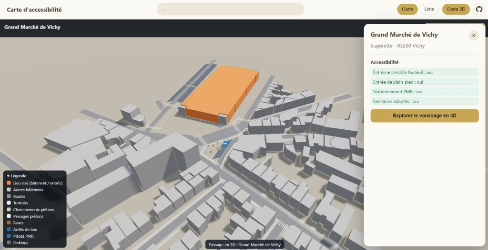

# accessibility-map-fr

Carte collaborative de l'accessibilité des lieux publics en France, à partir des
données [Acceslibre](https://acceslibre.beta.gouv.fr/). Il s'agit d'un site
statique (GitHub Pages) pensé pour les personnes en situation de handicap et
leurs accompagnants : on repère un lieu sur la carte, puis on explore son
voisinage immédiat en 3D pour anticiper l'accès avant de s'y rendre.

> Travail en cours, mené en collaboration avec [@JLZIMMERMANN](https://github.com/JLZIMMERMANN).



## Fonctionnalités

- **Carte 2D** (MapLibre GL) : regroupement (clustering) des établissements
  Acceslibre sur toute la France, calculé dans un *Web Worker* (Supercluster)
  pour garder l'interface fluide même avec plusieurs centaines de milliers de
  points. Fond de carte CARTO sobre, attribution personnalisée, voile atténuant
  ce qui n'est pas la France (métropole + territoires d'outre-mer).
- **Recherche unique** : un seul champ pour chercher par nom de lieu, ville ou
  code postal (accents et casse indifférents). La sélection recentre la carte
  sur le lieu ou le quartier.
- **Vue liste accessible** (RGAA/WCAG) : les lieux de l'emprise visible,
  navigables au clavier avec des libellés explicites — l'alternative textuelle
  à la carte et à la 3D.
- **Fiche de lieu** : critères d'accessibilité détaillés et bouton d'entrée dans
  la vue 3D du voisinage.
- **Vue 3D du voisinage** (Three.js / WebGL) : les 100 derniers mètres autour du
  lieu. Bâtiments extrudés (le bâtiment cible, identifié par son nom OSM, est
  mis en évidence), trottoirs avec relief, passages piétons rayés, cheminements
  piétons, routes, arrêts de bus, places PMR, parkings et bancs, à partir
  d'OpenStreetMap (Overpass).
- **Transition 2D → 3D** : automatique quand on zoome au plus près d'un lieu, ou
  manuelle via le bouton dédié. Le module 3D et le voisinage sont préchargés
  pour une bascule quasi instantanée.

## Architecture

```
pipeline/     Scripts Node (au build) : Acceslibre → GeoJSON → données compactes
frontend/     Application Vite + TypeScript
  src/map/         Carte MapLibre, couches, popup
  src/data/        Chargement + clustering (Web Worker Supercluster), Overpass
  src/three/       Scène 3D du voisinage (Three.js)
  src/accessible/  Vue liste accessible (alternative RGAA)
.github/workflows/  Traitement des données + déploiement GitHub Pages
```

La clé d'API Acceslibre n'est utilisée **qu'au moment du build** (secret GitHub
Actions), jamais côté navigateur.

## Développement local

### Frontend (mode échantillon, sans clé)

```bash
cd frontend
npm install
npm run dev
```

L'application lit `public/data/config.json` et `public/data/sample.geojson`
(échantillon parisien versionné). Aucune clé n'est requise.

### Régénérer l'échantillon (nécessite la clé Acceslibre)

```bash
cd pipeline
ACCESLIBRE_API_KEY=xxx node src/make-sample.mjs --commune Paris --max-pages 14
```

La vue 3D fonctionne directement (Three.js est empaqueté avec le frontend) et
récupère le voisinage à la volée depuis Overpass. Si Overpass est momentanément
indisponible, l'application reste pleinement utilisable en 2D.

## Données en production (France entière)

Les données pré-traitées de toute la France sont hébergées dans un dépôt dédié,
[thepriben/accessibility-map-data](https://github.com/thepriben/accessibility-map-data),
et servies par **son propre GitHub Pages** (`https://thepriben.github.io/accessibility-map-data/`),
sur la même origine que le site. Le fichier est chargé une seule fois par le
*Web Worker*, qui répond ensuite instantanément aux requêtes de la carte.

Ce dépôt de données est reconstruit **chaque semaine** depuis l'export CSV ouvert
d'Acceslibre (data.gouv.fr, sans clé). Les coordonnées sont validées (détection
des latitude/longitude inversées, filtrage des points hors zone). Comme
`config.json` pointe vers l'URL des données, un rafraîchissement hebdomadaire est
pris en compte **sans redéploiement** du site.

Le dossier `pipeline/` reste utile en local (échantillon, appels à l'API).

## Secrets à configurer (Settings → Secrets and variables → Actions)

- `ACCESLIBRE_API_KEY` : clé d'API Acceslibre (à **régénérer** en cas de fuite).
  Utilisée uniquement au build ; l'export CSV public ne la requiert pas.

## Sources et licences

- Établissements : Acceslibre (Licence Ouverte / Etalab 2.0).
- Bâtiments, cheminements et mobilier du voisinage : OpenStreetMap (ODbL), via
  l'API Overpass.
- Fonds de carte : CARTO (données OpenStreetMap).
